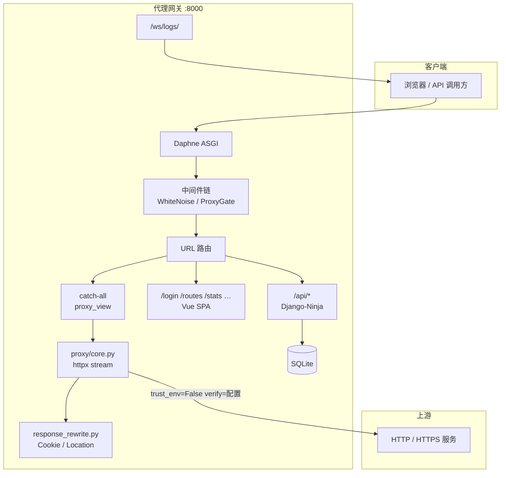
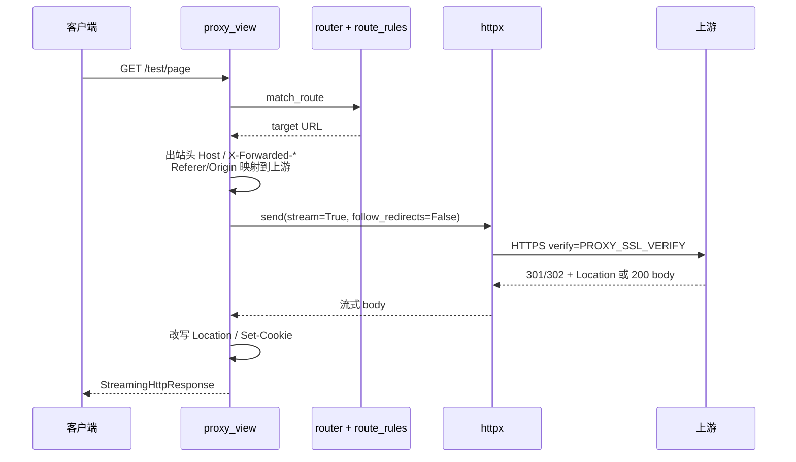

# 透明反向代理网关 — 项目文档

## 1. 项目简介

本项目是一个基于 **Django + Django-Ninja + ASGI** 的**透明 HTTP 反向代理网关**，行为类似 nginx 的 prefix forwarding（前缀转发），并提供可视化管理控制台。

### 1.1 核心能力

| 能力 | 说明 |
|------|------|
| 动态路由 | 管理台注册「路径前缀 → 上游 URL」，支持精确前缀与 `/*` 通配 |
| 透明转发 | 不改写 path，完整保留 Headers / Cookies / Body / Query |
| 响应适配 | 重写 `Set-Cookie` Path、`Location`（重定向）、`Referer`/`Origin` |
| 流式传输 | 大文件、chunked，默认不缓冲完整 body |
| 全异步 | ASGI + `httpx.AsyncClient` + `StreamingHttpResponse` |
| 管理 API | Django-Ninja + JWT |
| 运维 | 请求日志、**请求统计图表**、WebSocket 实时日志、上游健康检查 |
| 可扩展 | 负载均衡、熔断、限流、WebSocket 代理扩展点 |

### 1.2 转发语义（重要）

这是 **前缀转发（prefix forwarding）**，不是 path rewrite。

**示例（精确前缀）：**

- 网关：`http://192.168.1.2:8001`
- 规则：`/account` → `http://192.168.1.2:8000`
- 访问：`http://192.168.1.2:8001/account/login`
- 转发：`http://192.168.1.2:8000/account/login`

**示例（通配符）：**

| 注册前缀 | 匹配路径 | 说明 |
|----------|----------|------|
| `/robot/*` | `/robot`、`/robot/api/x` | `/robot` 作用域仅允许 **一条** 通配路由 |
| `/*` | 其余未匹配路径 | 全局兜底，全站仅 **一条** |

**匹配规则：**

1. **有效前缀长度**越长越优先（`/robot/*` 优先于 `/*`）
2. 同长度时 **精确前缀** 优先于 **通配**（`/robot` 优先于 `/robot/*`）

### 1.3 技术栈

**后端：** Django 6、Django-Ninja、Daphne、httpx、SQLite、WhiteNoise、Channels、loguru、Gunicorn + UvicornWorker  

**前端：** Vue 3、Vite、Pinia、Element Plus、ECharts

---

## 2. 系统架构

### 2.1 总体架构图



### 2.2 请求路径分类

| 路径模式 | 处理方 | 说明 |
|----------|--------|------|
| `/api/*` | Django-Ninja | 管理 API（JWT），不代理 |
| `/admin/*` | Django Admin | 后台 |
| `/assets/*` | 静态文件 | Vue 构建产物 |
| `/login`、`/routes`、`/stats` 等 | `spa_view` | 同步返回 `index.html` |
| 已注册前缀 / 通配 | `proxy_view` | 透明代理 |
| 未匹配 | 404 | 不转发 |

### 2.3 代理核心数据流



### 2.4 目录结构

```
django_proxy/
├── django_proxy/           # settings, urls, asgi, log_config
├── gateway/
│   ├── models.py           # ProxyRoute, ProxyLog, NodeStatus, SystemConfig
│   ├── views.py            # proxy_view, spa_view
│   ├── api/                # auth, routes, nodes, logs, stats, config
│   ├── proxy/
│   │   ├── core.py         # 异步流式转发
│   │   ├── client.py       # httpx 连接池
│   │   ├── router.py       # 匹配与 URL 构建
│   │   ├── route_rules.py  # 通配符规范化与唯一性校验
│   │   ├── response_rewrite.py  # Cookie / 重定向 / Referer
│   │   ├── ssl_config.py   # PROXY_SSL_VERIFY
│   │   ├── headers.py
│   │   ├── connectivity.py # 502 友好提示
│   │   └── route_cache.py
│   ├── services/           # health_checker, log_broadcaster
│   ├── schemas/            # 含 stats.py
│   ├── middleware/proxy_gate.py
│   ├── consumers.py
│   ├── tests/              # router, route_rules, response_rewrite
│   └── extensibility/
├── frontend/src/views/     # Routes, Nodes, Logs, Stats, Live, Config
├── data/db.sqlite3
├── logs/
└── docs/
```

### 2.5 数据模型

| 模型 | 用途 |
|------|------|
| `ProxyRoute` | 前缀（含 `/*`）、`target_url`、启用、`is_wildcard`（API 输出） |
| `ProxyLog` | 请求/响应元数据、延迟、错误 |
| `NodeStatus` | 上游在线、响应时间 |
| `SystemConfig` | 健康检查间隔等 KV |

### 2.6 管理台页面

| 页面 | 路径 | 说明 |
|------|------|------|
| 登录 | `/login` | JWT |
| 路由管理 | `/routes` | 精确前缀与通配符 |
| 节点状态 | `/nodes` | 健康检查、立即检测 |
| 请求日志 | `/logs` | 分页列表 |
| **请求统计** | `/stats` | ECharts：趋势、状态码、方法、TOP 路径 |
| 实时日志 | `/live` | WebSocket |
| 系统配置 | `/config` | KV 配置 |

---

## 3. 路由与通配符

### 3.1 前缀格式

| 类型 | 示例 | 存储形式 |
|------|------|----------|
| 精确 | `/account` | `/account` |
| 作用域通配 | `/robot/*` | `/robot/*` |
| 全局兜底 | `/*` | `/*` |

- 通配符 **只能** 出现在末尾 `/*`
- 不允许 `/robot*`、多个 `*`

### 3.2 唯一性约束（保存路由时 API 校验）

| 规则 | 说明 |
|------|------|
| 数据库 `prefix` 唯一 | 不能重复注册相同前缀 |
| 每作用域一条通配 | 不能有两条 `/*` 或两条 `/robot/*` |
| 通配与精确互斥 | 已有 `/robot/*` 时，不能再加 `/robot`、`/robot/api` |
| 添加通配前 | 若已有 `/robot` 等，不能再加 `/robot/*` |
| `/*` 与精确路由 | **可共存**（精确路由优先匹配；`/*` 作兜底） |

实现位置：`gateway/proxy/route_rules.py`、`gateway/api/routes.py`。

### 3.3 匹配实现

- `gateway/proxy/router.py`：`prefix_matches`、`match_route`
- 通配符有效前缀：`route.effective_prefix`（如 `/robot/*` → `/robot`）
- Cookie / `Location` 改写使用 `effective_prefix`，见 `response_rewrite.py`

---

## 4. 重定向（301 / 302 / 303 / 307 / 308）

### 4.1 行为

- httpx **`follow_redirects=False`**：代理 **不** 自动跟跳，由浏览器处理重定向链
- 上游状态码 **原样** 返回（含 301/302）
- **`Location`** 改写为网关 URL（nginx `proxy_redirect` 语义）
- 支持绝对路径、相对路径、协议相对 URL、上游 loopback 与 IP 混用场景

### 4.2 示例

上游返回：

```http
HTTP/1.1 302 Found
Location: http://127.0.0.1:8888/test/login/
```

网关前缀 `/test`，客户端收到：

```http
Location: http://网关主机:8000/test/login/
```

### 4.3 相关代码

- `gateway/proxy/response_rewrite.py`：`rewrite_location`、`REDIRECT_STATUS_CODES`
- `gateway/proxy/core.py`：debug 日志记录改写后的 Location

---

## 5. HTTPS 与 SSL 校验

### 5.1 现象

使用 `https://8.137.52.255/...` 等 **IP** 作为上游时，可能出现：

```text
[SSL: CERTIFICATE_VERIFY_FAILED] certificate verify failed: IP address mismatch
```

证书通常签在 **域名** 上，不包含 IP SAN。

### 5.2 推荐

1. 上游 URL 改为证书对应 **域名**（DNS 指向该 IP）
2. 或在内网使用 HTTP（无 TLS）

### 5.3 环境变量（仅可信内网）

```env
PROXY_SSL_VERIFY=false
```

修改后 **必须重启** 网关进程。启动日志会警告证书未校验。

可选自定义 CA：

```env
PROXY_SSL_CA_BUNDLE=/path/to/ca.pem
```

实现：`gateway/proxy/ssl_config.py`，代理与健康检查 httpx 客户端共用。

502 时 `connectivity.py` 会附加 SSL 相关排查提示。

---

## 6. 请求统计 API

基于 `ProxyLog` 聚合，需 JWT。时间范围参数 `hours`（1–720，默认 24）。

| 端点 | 说明 |
|------|------|
| `GET /api/logs/stats/overview` | 总量、成功率、平均/最大延迟、4xx/5xx |
| `GET /api/logs/stats/timeline` | 时间序列（自动按 1h/6h/24h/7d 选分钟/小时/天桶） |
| `GET /api/logs/stats/status` | 2xx/3xx/4xx/5xx 分布 |
| `GET /api/logs/stats/methods` | 按 HTTP 方法 |
| `GET /api/logs/stats/top-paths` | 热门路径 TOP N |

实现：`gateway/services/stats.py`、`gateway/api/stats.py`（挂载在 `/api/logs/stats`）。

前端：`frontend/src/views/StatsView.vue`（ECharts）。

---

## 7. 关键实现约束

- `httpx.AsyncClient` + `async def` + `StreamingHttpResponse`
- 禁止 `requests`、同步整包响应（默认）
- 过滤 Hop-by-Hop：`Connection`、`Keep-Alive`、`Transfer-Encoding`、`Upgrade` 等
- 出站：`Host`、`X-Forwarded-For`、`X-Forwarded-Host`、`X-Forwarded-Proto`
- `trust_env=False`、`proxy=None`（不走系统 HTTP_PROXY）

**转发模式 `PROXY_FORWARD_MODE`：**

| 值 | 说明 |
|----|------|
| `stream`（默认） | `send(stream=True)` + `aiter_bytes()` |
| `buffered` | 整包缓冲，仅排障 |

---

## 8. 部署与运行

### 8.1 开发环境

```bash
pip install -r requirements.txt
python manage.py migrate
python manage.py init_gateway
python manage.py createsuperuser

python manage.py runserver 8000
# 或: daphne -b 0.0.0.0 -p 8000 django_proxy.asgi:application

cd frontend && npm install && npm run build
# 开发: npm run dev
```

### 8.2 环境变量

参见项目根目录 `.env.example`。完整列表见下文 **§10 配置项速查**。

### 8.3 生产建议

- `DJANGO_DEBUG=false`，强 `SECRET_KEY`
- `gunicorn django_proxy.asgi:application -c gunicorn.conf.py`
- Channels 配置 `REDIS_URL`
- 上游 Django：`ALLOWED_HOSTS` 含代理 `Host`
- HTTPS 上游：使用域名或明确评估 `PROXY_SSL_VERIFY=false` 风险

### 8.4 单元测试

```bash
python manage.py test gateway.tests
```

覆盖：通配符匹配与校验、Location 改写等。

---

## 9. 开发过程中遇到的问题与解决方案

### 9.1 健康检查：`SynchronousOnlyOperation`

**解决：** ORM 使用 `asyncio.to_thread` + `close_old_connections()`。

### 9.2 登录 / SPA 500：`coroutine` 无 `status_code`

**解决：** `ProxyGateMiddleware` 继承 `MiddlewareMixin`；SPA 使用同步 `spa_view` 独立路由。

### 9.3 代理与健康检查 502，浏览器直连正常

**原因：** `httpx` 默认 `trust_env=True`，请求被系统 `HTTP_PROXY` 绕回本网关。

**解决：** `trust_env=False`、`proxy=None`；健康检查用 GET、探测路由前缀路径。

### 9.4 上游 Django CSRF：`cookie not set`

**原因：** `Set-Cookie` Path 为上游路径，浏览器在网关前缀下不携带 Cookie。

**解决：** `response_rewrite.py` 重写 `Set-Cookie` Path、`Location`、`Referer`/`Origin`。

### 9.5 重定向跳到上游 IP/端口

**解决：** `rewrite_location` 将 `Location` 映射回网关；`follow_redirects=False` 保持透明。

### 9.6 HTTPS 证书 IP 不匹配

**解决：** 上游改用域名；或 `PROXY_SSL_VERIFY=false`（内网）；见 **§5**。

### 9.7 健康检查阻塞、SQLite 锁

**解决：** 批量写库、`HEALTH_CHECK_CONCURRENCY`、手动检测后台线程；SQLite WAL（`gateway/db.py`）。

### 9.8 loguru 集成

**实现：** `django_proxy/log_config.py`，`print` 重定向、Django logging 桥接、`logs/proxy_YYYY-MM-DD.log`。

---

## 10. 配置项速查

| 变量 | 默认值 | 说明 |
|------|--------|------|
| `PROXY_FORWARD_MODE` | `stream` | `stream` / `buffered` |
| `PROXY_CONNECT_TIMEOUT` | `10` | 连接超时（秒） |
| `PROXY_READ_TIMEOUT` | `300` | 读超时（秒） |
| `PROXY_SSL_VERIFY` | `true` | `false` 关闭上游 HTTPS 证书校验 |
| `PROXY_SSL_CA_BUNDLE` | 空 | 自定义 CA 路径 |
| `HTTPX_MAX_CONNECTIONS` | `200` | 连接池上限 |
| `HTTPX_MAX_KEEPALIVE` | `50` | 保活连接数 |
| `HEALTH_CHECK_ENABLED` | `true` | 是否启用健康检查 |
| `HEALTH_CHECK_INTERVAL` | `30` | 检查周期（秒） |
| `HEALTH_CHECK_TIMEOUT` | `5` | 单次探测超时（秒） |
| `HEALTH_CHECK_CONCURRENCY` | `5` | 并发探测数 |
| `LOG_LEVEL` | `INFO` | 日志级别 |
| `LOG_TO_FILE` | `true` | 写文件日志 |
| `PATCH_PRINT` | `true` | `print` → loguru |
| `LOG_RETENTION_DAYS` | `7` | 日志保留天数 |
| `REDIS_URL` | 空 | Channels Redis（可选） |
| `JWT_EXPIRE_SECONDS` | `86400` | JWT 过期时间 |

---

## 11. 管理 API 一览

| 方法 | 路径 | 说明 |
|------|------|------|
| POST | `/api/auth/login` | 登录（无需 JWT） |
| GET/POST | `/api/routes` | 路由列表 / 创建 |
| GET/PUT/DELETE | `/api/routes/{id}` | 路由详情 / 更新 / 删除 |
| GET | `/api/nodes` | 节点状态 |
| POST | `/api/nodes/check` | 立即健康检查 |
| GET | `/api/logs` | 请求日志列表 |
| GET | `/api/logs/{id}` | 单条日志 |
| GET | `/api/logs/stats/overview` | 统计概览 |
| GET | `/api/logs/stats/timeline` | 趋势序列 |
| GET | `/api/logs/stats/status` | 状态码分布 |
| GET | `/api/logs/stats/methods` | 方法分布 |
| GET | `/api/logs/stats/top-paths` | 热门路径 |
| GET/PUT | `/api/config` | 系统配置 |

交互式文档：`/api/docs`。

---

## 12. 扩展点（未默认启用）

`gateway/extensibility/`：`load_balancer.py`、`circuit_breaker.py`、`rate_limiter.py`、`websocket_proxy.py`。

---

## 13. 常见问题 FAQ

**Q：注册了 `/test`，访问 `/` 为什么 404？**  
A：仅匹配已注册前缀；`/` 未注册则不走代理。

**Q：如何配置全局兜底？**  
A：添加一条 `/*` → 上游 URL，全站只能一条；更具体的前缀（如 `/api`）仍优先。

**Q：`/robot/*` 和 `/robot` 能同时存在吗？**  
A：可以；访问 `/robot/x` 时若两者都存在，**精确** `/robot` 优先于 `/robot/*`。

**Q：能否在已有 `/robot/*` 时再建 `/robot/api`？**  
A：不能，API 会返回 400，同一作用域仅允许一种覆盖方式。

**Q：修改路由后不生效？**  
A：`post_save` 会失效路由缓存；仍异常可重启进程。

**Q：HTTPS 上游用 IP 报证书错误？**  
A：见 **§5**；或 `PROXY_SSL_VERIFY=false` 后重启。

**Q：上游 302 后浏览器跳到上游地址？**  
A：确认已部署含 `response_rewrite` 的版本；查看 debug 日志中改写后的 `Location`。

**Q：统计页无数据？**  
A：需先有经代理的流量并写入 `ProxyLog`；调整统计时间范围后刷新。

**Q：实时日志 WebSocket 连不上？**  
A：开发可用 InMemory Channel Layer；生产多 worker 需 `REDIS_URL`。

---

## 14. 版本与维护

- 文档更新日期：**2026-05-17**
- Django 6.x / Python 3.12+
- 核心代码以 `gateway/proxy/`、`gateway/api/`、`gateway/services/` 为准。
