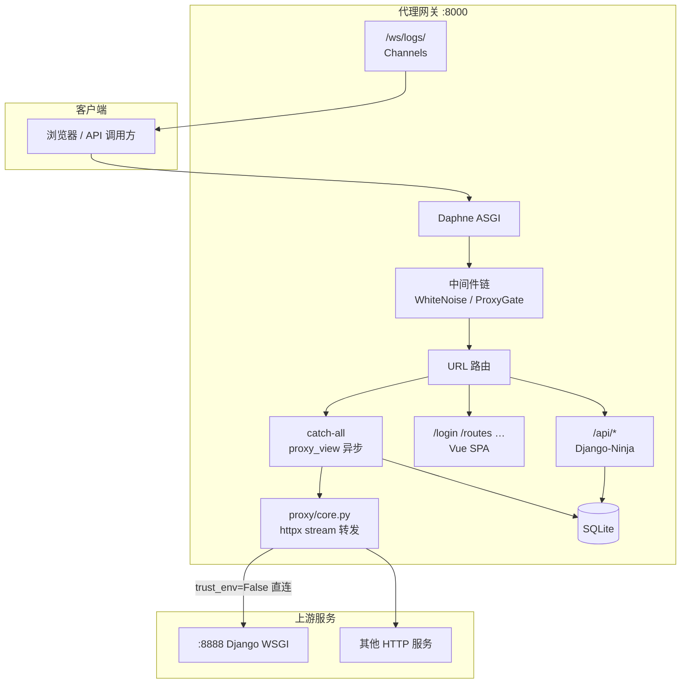
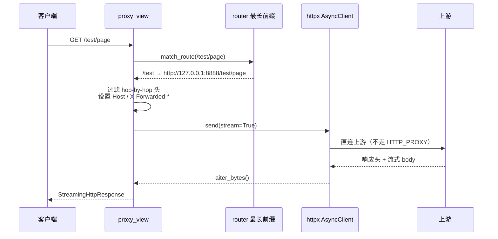

# 透明反向代理网关 — 项目文档

## 1. 项目简介

本项目是一个基于 **Django + Django-Ninja + ASGI** 的**透明 HTTP 反向代理网关**，行为类似 nginx 的 prefix forwarding（前缀转发），并提供可视化管理控制台。

### 1.1 核心能力

| 能力 | 说明 |
|------|------|
| 动态路由 | 在管理台注册「路径前缀 → 上游 URL」，无需改代码、无需重启 |
| 透明转发 | 不改写 path，完整保留 Headers / Cookies / Body / Query |
| 流式传输 | 大文件上传下载、chunked 响应，不缓冲完整 body |
| 全异步 | ASGI + `async def` + `httpx.AsyncClient` + `StreamingHttpResponse` |
| 管理 API | Django-Ninja + JWT |
| 运维能力 | 请求日志、WebSocket 实时日志、上游健康检查 |
| 可扩展 | 预留负载均衡、熔断、限流、WebSocket 代理扩展点 |

### 1.2 转发语义（重要）

这是 **前缀转发（prefix forwarding）**，不是 path rewrite。

**示例：**

- 网关监听：`http://192.168.1.2:8001`
- 注册规则：`/account` → `http://192.168.1.2:8000`
- 用户访问：`http://192.168.1.2:8001/account/login`
- 实际转发：`http://192.168.1.2:8000/account/login`（路径原样拼接）

**路由匹配：** 最长前缀优先（`/api/admin` 优先于 `/api`）。

### 1.3 技术栈

**后端**

- Django 6、Django-Ninja、ASGI（Daphne）
- httpx.AsyncClient（禁止 requests / 同步 HttpResponse）
- SQLite3、WhiteNoise、Django Channels
- loguru（系统日志 + 接管标准 logging + `print` 重定向）
- Gunicorn + UvicornWorker（生产）

**前端**

- Vue 3、Vite、Pinia、Element Plus

---

## 2. 系统架构

### 2.1 总体架构图



### 2.2 请求路径分类

| 路径模式 | 处理方 | 说明 |
|----------|--------|------|
| `/api/*` | Django-Ninja | 管理接口（JWT），不参与代理 |
| `/admin/*` | Django Admin | 后台 |
| `/assets/*` | 静态文件 | Vue 构建产物 |
| `/login`、`/routes` 等 | `spa_view` | 同步返回 `index.html` |
| 其他已注册前缀 | `proxy_view` → `forward_request` | 透明代理到上游 |
| 未匹配前缀 | 404 | 不转发 |

### 2.3 代理核心数据流



### 2.4 目录结构

```
django_proxy/
├── django_proxy/           # 项目配置
│   ├── settings.py
│   ├── urls.py
│   ├── asgi.py             # HTTP + WebSocket 协议路由
│   └── log_config.py       # loguru 配置
├── gateway/                # 核心应用
│   ├── models.py           # ProxyRoute / ProxyLog / NodeStatus / SystemConfig
│   ├── views.py            # proxy_view / spa_view
│   ├── api/                # Ninja 管理 API
│   ├── proxy/
│   │   ├── core.py         # 异步流式转发
│   │   ├── client.py       # httpx 连接池
│   │   ├── router.py       # 前缀匹配与 URL 构建
│   │   ├── headers.py      # Hop-by-hop 过滤
│   │   └── route_cache.py  # 路由内存缓存
│   ├── services/
│   │   ├── health_checker.py
│   │   └── log_broadcaster.py
│   ├── middleware/proxy_gate.py
│   ├── consumers.py        # 实时日志 WebSocket
│   └── extensibility/      # 负载均衡 / 熔断 / 限流 扩展点
├── frontend/               # Vue3 管理台
├── data/db.sqlite3
├── logs/                   # loguru 文件日志
└── docs/
```

### 2.5 数据模型

| 模型 | 用途 |
|------|------|
| `ProxyRoute` | 前缀、`target_url`、启用状态 |
| `ProxyLog` | 方法、路径、目标 URL、状态码、头、延迟、客户端 IP |
| `NodeStatus` | 上游在线状态、响应时间、错误信息 |
| `SystemConfig` | 健康检查间隔、日志保留等 KV 配置 |

### 2.6 管理台页面

1. 登录（JWT）
2. 路由管理
3. 节点状态（健康检查）
4. 请求日志
5. 实时日志（WebSocket `/ws/logs/`）
6. 系统配置

---

## 3. 关键实现约束

生产级代理必须满足：

- `httpx.AsyncClient` 异步请求
- `async def` 视图
- `StreamingHttpResponse`，禁止先读完整响应再返回
- 过滤 Hop-by-Hop 头：`Connection`、`Keep-Alive`、`Transfer-Encoding`、`Upgrade` 等
- 禁止使用 `requests`、同步 `HttpResponse`、同步 view

**转发模式（`PROXY_FORWARD_MODE`）：**

| 值 | 说明 |
|----|------|
| `stream`（默认） | `build_request` + `send(stream=True)` + `aiter_bytes()` |
| `buffered` | 整包缓冲后返回，仅用于排障，不适合大文件 |

---

## 4. 部署与运行

### 4.1 开发环境

```bash
# 后端依赖
pip install -r requirements.txt
python manage.py migrate
python manage.py init_gateway
python manage.py createsuperuser

# 启动 ASGI（推荐）
daphne -b 0.0.0.0 -p 8000 django_proxy.asgi:application
# 或
python manage.py runserver 8000

# 前端
cd frontend && npm install && npm run build
# 开发时也可 npm run dev（Vite 代理 /api 到 8000）
```

### 4.2 环境变量（节选）

```env
DJANGO_SECRET_KEY=...
DJANGO_DEBUG=true
LOG_LEVEL=INFO
LOG_TO_FILE=true
PATCH_PRINT=true

PROXY_FORWARD_MODE=stream
PROXY_CONNECT_TIMEOUT=10
PROXY_READ_TIMEOUT=300

HEALTH_CHECK_INTERVAL=30
HEALTH_CHECK_TIMEOUT=5

REDIS_URL=redis://127.0.0.1:6379/0   # 可选，Channels 多进程时用
JWT_EXPIRE_SECONDS=86400
```

### 4.3 生产建议

- `DJANGO_DEBUG=false`，更换 `SECRET_KEY`
- Gunicorn + `uvicorn.workers.UvicornWorker`（见 `gunicorn.conf.py`）
- Channels 使用 Redis Channel Layer
- 上游为 Django 时，确保 `ALLOWED_HOSTS` 包含代理设置的 `Host` 头

---

## 5. 开发过程中遇到的问题与解决方案

### 5.1 健康检查线程：`SynchronousOnlyOperation`

**现象**

```
django.core.exceptions.SynchronousOnlyOperation:
You cannot call this from an async context - use a thread or sync_to_async.
```

健康检查在后台线程的 `asyncio` 循环里直接调用 `SystemConfig.objects.get()`。

**原因**

Django ORM 为同步 API，在 async 协程中不能直接调用。

**解决**

- 所有 ORM 操作用 `asyncio.to_thread()` 执行
- 在线程内配合 `close_old_connections()` 管理 DB 连接

---

### 5.2 登录接口 500：`coroutine` 没有 `status_code`

**现象**

```
AttributeError: 'coroutine' object has no attribute 'status_code'
RuntimeWarning: coroutine 'ProxyGateMiddleware.__call__' was never awaited
```

访问 `/api/auth/login` 失败。

**原因**

`ProxyGateMiddleware` 只实现了 `async def __call__`，在同步中间件链（或部分 ASGI 路径）中返回了**未 await 的协程**。

**解决**

改为继承 `MiddlewareMixin`，或同时提供：

- `def __call__` — 同步路径
- `async def __acall__` — 异步路径（由 `MiddlewareMixin` 自动切换）

最终实现为 `MiddlewareMixin` + `process_request` 标记 `request.proxy_skip`。

---

### 5.3 访问 `/login` 500：异步视图与中间件不兼容

**现象**

与 5.2 类似，`/login` 命中异步 `proxy_view`，返回 coroutine；或出现 `HttpResponseServerError can't be awaited`。

**原因**

控制台路由不应走异步 catch-all 代理；SPA 与代理共用 catch-all 时在 Daphne 下易触发异步/同步混用问题。

**解决**

1. 为 SPA 增加**同步**路由：`/login`、`/routes`、`/nodes` 等 → `spa_view` 返回 `index.html`
2. catch-all 仅保留 `proxy_view` 处理已注册代理前缀
3. 中间件使用 `MiddlewareMixin`

---

### 5.4 健康检查与代理均返回 502，浏览器直连上游正常

**现象**

- httpx 访问 `http://127.0.0.1:8888/` → **502**，`content-length: 0`，无 `Server: WSGIServer` 头
- 浏览器访问同一地址 → **404**，`Server: WSGIServer/0.2`，有正常 HTML body
- 通过网关访问 `/test` → **502**

**原因（核心）**

`httpx.AsyncClient` 默认 **`trust_env=True`**，会读取系统环境变量：

- `HTTP_PROXY` / `HTTPS_PROXY` / `ALL_PROXY`

若代理指向本机网关（如 `http://127.0.0.1:8000`），则：

1. 健康检查或转发请求访问 `127.0.0.1:8888` 时，实际被发到 **8000 网关**
2. 网关再次尝试转发 → 环路或错误处理 → **502 Bad Gateway**

浏览器通常不走该环境代理，故直连上游正常。

**解决**

1. **代理客户端**（`gateway/proxy/client.py`）：

   ```python
   httpx.AsyncClient(trust_env=False, proxy=None, ...)
   ```

2. **健康检查客户端**（`gateway/services/health_checker.py`）：同样 `trust_env=False`

3. 启动时若检测到代理环境变量，打 **warning** 日志提示已忽略

4. 健康检查改为：
   - 使用 **GET**（与浏览器一致）
   - 优先探测 **路由前缀路径**（如 `/test` → `http://127.0.0.1:8888/test`）
   - 再回退探测上游根路径 `/`

**本地排查命令**

```powershell
echo $env:HTTP_PROXY
echo $env:ALL_PROXY
# 如有值可临时清空：
$env:HTTP_PROXY=""; $env:HTTPS_PROXY=""; $env:ALL_PROXY=""
```

---

### 5.5 健康检查 HEAD 返回 502、GET 也 502（修复前）

**现象**

对根路径先发 `HEAD`，返回 502；fallback `GET` 仍 502（实为 5.4 的代理环境问题）。

**曾误判**

以为上游不支持 `HEAD`，仅 HEAD 有问题。

**补充说明**

在修复 `trust_env` 后，HEAD 仍可能不被部分 WSGI 服务支持；当前健康检查**仅用 GET**，并探测前缀路径。

---

### 5.6 代理核心：手动 `stream()` 上下文与请求体

**现象**

转发不稳定、502、连接异常。

**原因**

1. 手动 `upstream_cm.__aenter__()` / `__aexit__()` 在 `StreamingHttpResponse` 迭代器中管理，易与客户端断开、异常路径冲突
2. 对 GET 请求传入异步 body 生成器，可能干扰 httpx
3. 未捕获 `send()` 前的 `RequestError`

**解决（当前方案）**

```python
req = client.build_request(method, url, headers=..., content=body or None)
upstream = await client.send(req, stream=True)
try:
    async for chunk in upstream.aiter_bytes():
        yield chunk
finally:
    await upstream.aclose()
```

- GET/HEAD 等：`content=None`
- 请求体：`sync_to_async` 读取 `request.body` 一次
- 连接失败：返回明确 `502 StreamingHttpResponse`
- 出站头：过滤 hop-by-hop，设置 `Host`、`X-Forwarded-For`、`X-Forwarded-Host`、`X-Forwarded-Proto`

**备用方案**

设置 `PROXY_FORWARD_MODE=buffered` 使用整包 `client.request()`，仅用于排障。

---

### 5.7 loguru 集成

**需求**

- 系统日志用 loguru
- `print()` → `logger.info`（绿色显示）
- Django / Daphne 标准 logging 桥接到 loguru

**实现**

- `django_proxy/log_config.py`：`InterceptHandler`、`configure_loguru()`
- `print` 通过 `inspect` 定位**真实调用文件行号**（非 `print_to_logger` 内部）
- 日志文件：`logs/proxy_YYYY-MM-DD.log`，按天轮转

---

## 6. 配置项速查

| 变量 | 默认值 | 说明 |
|------|--------|------|
| `PROXY_FORWARD_MODE` | `stream` | `stream` / `buffered` |
| `PROXY_CONNECT_TIMEOUT` | `10` | 连接超时（秒） |
| `PROXY_READ_TIMEOUT` | `300` | 读超时（秒） |
| `HEALTH_CHECK_INTERVAL` | `30` | 健康检查周期（秒） |
| `HEALTH_CHECK_TIMEOUT` | `5` | 单次探测超时（秒） |
| `LOG_LEVEL` | `INFO` | 日志级别 |
| `PATCH_PRINT` | `true` | 是否劫持 print |
| `REDIS_URL` | 空 | Channels 使用 Redis（可选） |

---

## 7. 扩展点（未默认启用）

`gateway/extensibility/` 预留：

| 模块 | 说明 |
|------|------|
| `load_balancer.py` | 多上游轮询/权重 |
| `circuit_breaker.py` | 熔断 |
| `rate_limiter.py` | 内存令牌桶限流 |
| `websocket_proxy.py` | WebSocket 透明代理占位 |

在 `forward_request` 前按路由挂载即可。

---

## 8. 常见问题 FAQ

**Q：注册了 `/test` → `http://127.0.0.1:8888`，访问网关 `/` 为什么 404？**  
A：只有匹配已注册前缀的请求才会代理；`/` 未注册则走 SPA 或 404。

**Q：上游 Django 报 DisallowedHost？**  
A：在 upstream `ALLOWED_HOSTS` 中加入代理设置的 Host（如 `127.0.0.1:8888`），或 `*`（仅开发）。

**Q：修改路由后不生效？**  
A：路由有内存缓存，`post_save` 信号会失效缓存；若仍异常可重启进程。

**Q：实时日志 WebSocket 连不上？**  
A：开发可用 InMemory Channel Layer；多 worker 生产环境需配置 `REDIS_URL`。

---

## 9. 版本与维护

- 文档更新日期：2026-05-17
- Django 6.x / Python 3.12+
- 本文档随代码演进更新，问题排查以 `gateway/proxy/core.py`、`gateway/proxy/client.py`、`gateway/services/health_checker.py` 为准。
